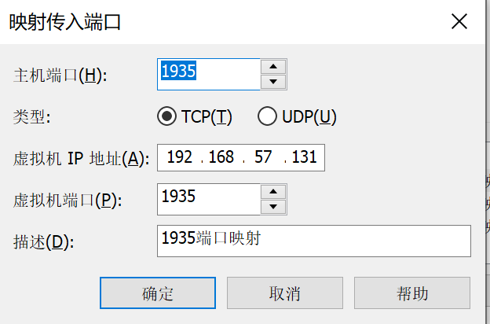
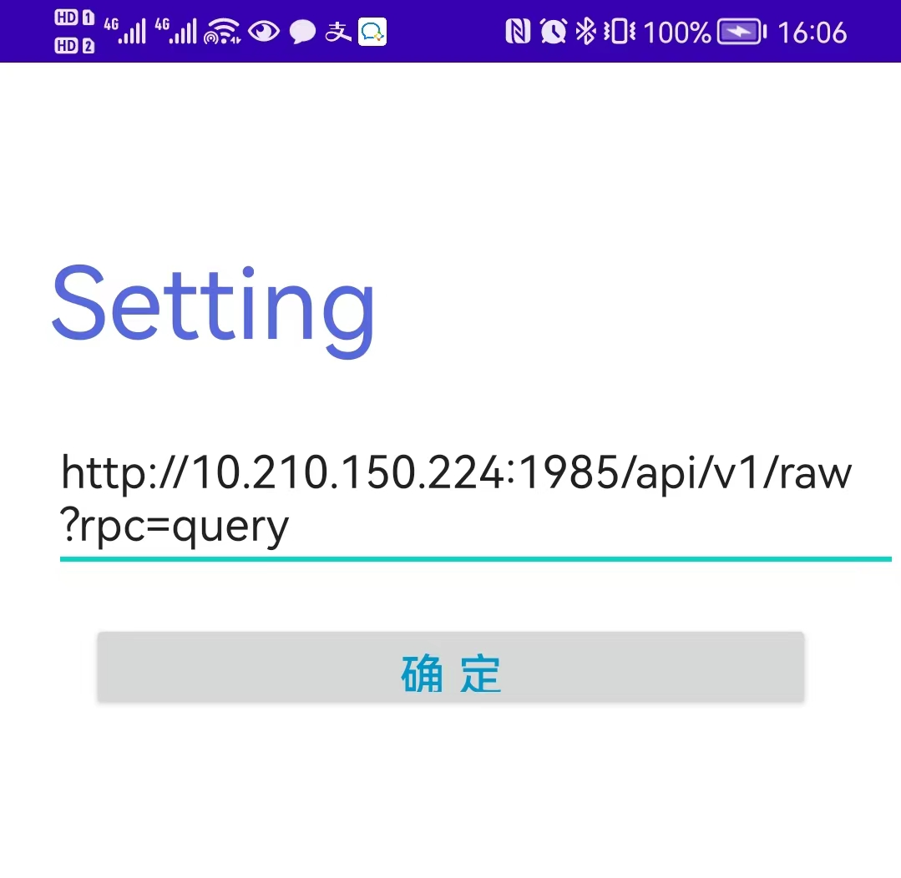
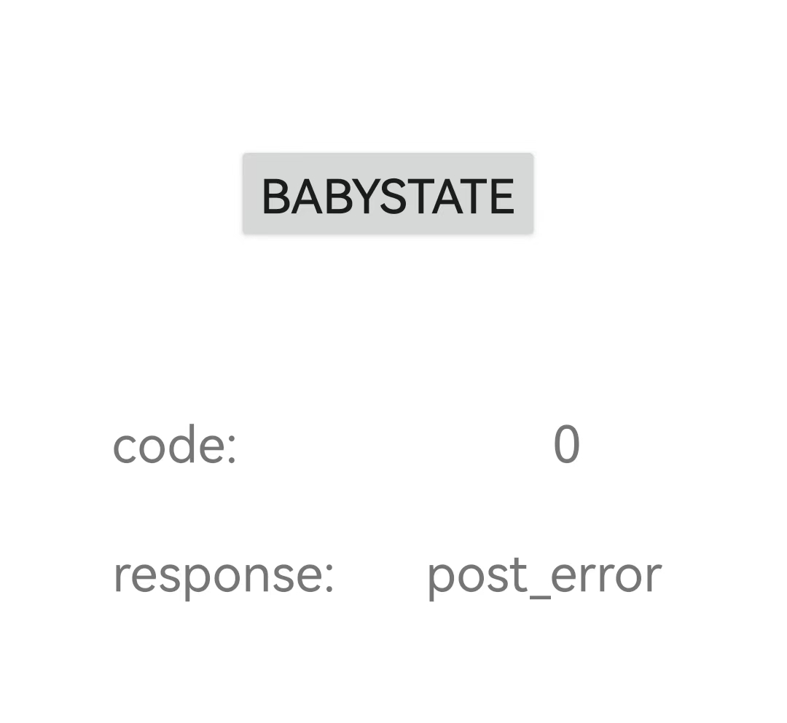

## Baby Monitor Demo部署教程

演示设备：一台笔记本电脑，一部安卓手机，一台播放哭声的手机设备。笔记本电脑用于推流和转发流，安卓手机用于查看当前演示结果。

演示场景：


### 一.  流处理服务部署

##### 1. 新建vmware  ubuntu18系统

ubuntu18 iso文件下载链接：https://mirrors.tuna.tsinghua.edu.cn/ubuntu-releases/18.04/ubuntu-18.04.6-live-server-amd64.iso


##### 2. 搭建python环境：

1. 安装python3，以及pip

```
>>sudo apt update
>>sudo apt upgrade
>>sudo apt-get install python3 build-essential gcc make perl dkms python3-pip net-tools
>>pip install requests ffmpy
```

上述第三步骤如遇到问题可指定源安装：

```
>>pip install requests ffmpy -i https://pypi.tuna.tsinghua.edu.cn/simple
```


##### 3. 搭建ffmpeg环境：

1. 由于国外的源无法安装ffmpeg，在安装ffmpeg前对源进行修改：

```
# 删除原源配置文件（注意：删除前可备份/etc/apt/sources.list文件，以防出错）
>>sudo rm -rf /etc/apt/sources.list
# 配置为国内源
>>sudo nano /etc/apt/sources.list
# 打开文件后，将下述源配置粘贴进文件：

deb https://mirrors.ustc.edu.cn/ubuntu/ focal main restricted universe multiverse
deb-src https://mirrors.ustc.edu.cn/ubuntu/ focal main restricted universe multiverse
deb https://mirrors.ustc.edu.cn/ubuntu/ focal-updates main restricted universe multiverse
deb-src https://mirrors.ustc.edu.cn/ubuntu/ focal-updates main restricted universe multiverse
deb https://mirrors.ustc.edu.cn/ubuntu/ focal-backports main restricted universe multiverse
deb-src https://mirrors.ustc.edu.cn/ubuntu/ focal-backports main restricted universe multiverse
deb https://mirrors.ustc.edu.cn/ubuntu/ focal-security main restricted universe multiverse
deb-src https://mirrors.ustc.edu.cn/ubuntu/ focal-security main restricted universe multiverse
deb https://mirrors.ustc.edu.cn/ubuntu/ focal-proposed main restricted universe multiverse
deb-src https://mirrors.ustc.edu.cn/ubuntu/ focal-proposed main restricted universe multiverse

# 保存退出
```

2. 安装ffmpeg

   ```
   >>sudo apt-get update
   >>sudo apt-get install ffmpeg
   ```

 （安装过程中如若需要更新包配置，或restart等，可选择No并跳过）


##### 4. 安装并启动web服务：

```
>>git clone https://github.com/huanmei9/babym_web.git
>>cd babym_web/srs/trunk/
>>./configure
>>make
>>./objs/srs -c conf/pc.conf
```

验证：在浏览器中输入 http://虚拟机ip:8081/players/srs_player.html?schema=http

若可以成功访问，则部署成功。


##### 5. 配置虚拟机端口映射：

添加端口映射（需要在虚拟机软件设置）：1935、1985、8081 

（主机端口和虚拟机端口映射为相同端口号）

比如：




### 二.  流推送软件安装OBS

##### obs设置：

1. 点击"设置"-"推流"-"服务栏"-"显示全部"-"自定义"
2. 服务器栏填入: rtmp://虚拟机ip:1935/live/
3. 串流密钥填入：livestream


###  三. 安装效果验证

obs开始推流，PC打开浏览器，输入：http://虚拟机ip:8081/players/srs_player.html?schema=http

如果能正常显示，则部署成功。


### 四. app通知

##### 1. 通知app下载：

app通知的apk文件存放于项目目录下./apk/babyM.apk , 请下载并安装在安卓手机上。

##### 2. 联网设置：

必须保证手机和电脑处于同一局域网下，app才可访问到当前婴儿状态。为此，需要保证以下操作：

1. 保证演示通知安卓手机连接到笔记本热点；（不支持手机4G或接入wifi）
2. 关闭笔记本的防火墙；

##### 3. 演示界面：

<center class="half">
    
    
</center>

在setting中输入当前请求获取婴儿哭声的服务接口，在第二个界面每隔1s请求婴儿状态并显示。


